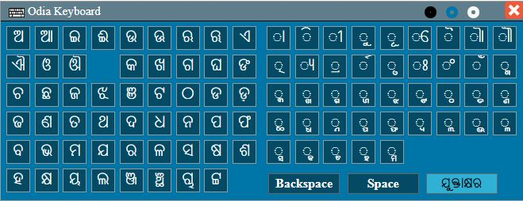
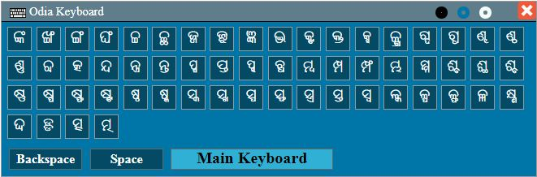

# odia-keyboard
Odia HTML Keyboad with theme and drag support

This a sample Odia keyboard script written in HTML and Java Script (jQuery).

Odia HTML keyboard uses odia web font.

* Three color theme (Black, White, Blue).
* Used draggabilly plugin to enable drag functionality.

Plugins used:
* bootstrap v3.3.4 css file
* draggabilly js file

How to use ?

Step-1:

Use below meta tag in <head> tag of your page

<meta http-equiv="Content-Type" content="text/html; charset=utf-8" />

In Java web application you may face an issue while showing dynamic content (odia font) from database. You may use the below filter.

	<filter>  
	    <filter-name>encodingFilter</filter-name>  
	    <filter-class>org.springframework.web.filter.CharacterEncodingFilter</filter-class>  
	    <init-param>  
	       <param-name>encoding</param-name>  
	       <param-value>UTF-8</param-value>  
	    </init-param>  
	    <init-param>  
	       <param-name>forceEncoding</param-name>  
	       <param-value>true</param-value>  
	    </init-param>  
	</filter>  
	<filter-mapping>  
	    <filter-name>encodingFilter</filter-name>  
	    <url-pattern>*.html</url-pattern>  
	</filter-mapping> 

Step-2:

Include below css files in <head> tag of your page. 

	<link href="css/odia-keyboard.css" rel="stylesheet" type="text/css" />
	<link href="css/bootstrap.min.css" rel="stylesheet" type="text/css" />

Step-3:

Include below script files before </body> tag. 

	
	
	

NB: Please make sure you have included only one jQuery file. (This example uses jQuery 3.1.1)

Sample Input field

	<input type="text" name="name" class="odia_char_input" id="odia_name" style="width: 250px;" required="">

Sample Keyboard picker image icon to trigger keyboard on click event.

	

Include content of div#odia_keyboard in your page.

	

	...

	

	
Update top and left position of the keyboard in odia-keyboard.css file

	#odia_keyboard{
	  font-size: 25px; 
	  display: none; 
	  left: 50px; 
	  top: 50px;
	}
	
<b>Screenshot:</b>

	
